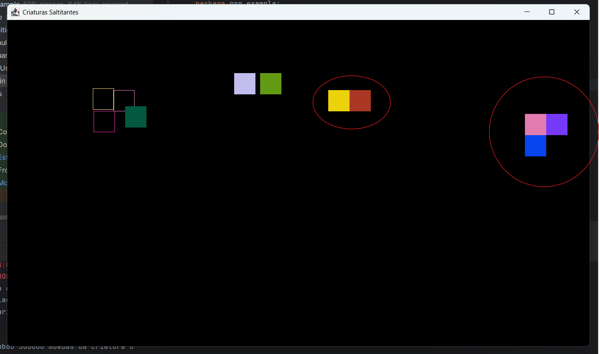

# Simulação de Criaturas Saltitantes

O seguinte trabalho é uma implementação de uma suíte de testes para uma simulação 
de criaturas saltitantes que roubam moedas entre si ao entrarem em contato.

## 📋 Sumário

- [Descrição](#descrição)
- [Novas funcionalidades](#Novas_Funcionalidades)
- [Testes](#Testes)
- [Tecnologias Utilizadas](#tecnologias-utilizadas)
- [Como Utilizar](#como-utilizar)

## 📖 Descrição

Esta aplicação é um simulador de entidades que se movementam por uma janela
assumindo uma trajetória que se assemelha à saltos. Foi  desenvolvida para ser alvo de 
testes de domínio, fronteira e estruturais. Os testes desenvolvidos avaliam o cumprimento
dos requisitos do domínio da simulação, além de testes sobre as fronteiras 
dos dados recebidos e 100% de cobertura de decisão.

### Inicicialização:
> As criaturas são dispostas no horizonte no começo da simulação, 
> em posições distintas.

### Movimentação:
> Assumidas as suas posições, as criaturas iniciam seu deslocamento
> pela tela através de uma trajetório semelhante a de pulos.

### Roubo de Moedas:
> Quando uma criatura entra em contato com outra durante seus
> deslocamentos, caso uma criatura seja tratada primeiro que a outra
> no loop de iterações, essa primeira irá roubar metade das moedas
> da segunda criatura, e ao mesmo tempo atualizando seus respectivos
> valores de X.

### Representação Gráfica:
>As crituras que tem suas moedas roubadas deixam de ser capazes de roubar
> e de serem roubadas outras vezes, e isso é representado pela perca do
> preenchimento interno de cor das criaturas.

## Novas Funcionalidades

### Clusters
> Os Clusters são representados pelos grupo de quadrados que se movem juntos




## ✨ Testes

### Testes de domínio
- Caso de testes simples: Execução comum da simulação com o valores para o número de criaturas 
entre os valores mínimo e máximo, e um tempo de execução suficientimente amplo para
```java
public void casoSimples(){
    assertThat(ProcessamentoCriaturas.processamento(100,60)).isEqualTo(1);
}
```

- Caso de teste para a criatura que rouba: Esse teste verifica se a quantidade de
moedas que a criatura rouba é somada ao seu respectivo total de moedas;
```java
public void testReceberMoedasComValorValido() {
        Criatura criatura = new Criatura(0, 0, 1, 0, (byte)255, (byte)0, (byte)0, (byte)255, 0.5);
        int moedasAntes = criatura.getMoedas();
        criatura.receiveCoins(500);
        assertEquals(moedasAntes + 500, criatura.getMoedas());
        assertTrue(criatura.getXi() > criatura.getLastXi()); // Verifica o domínio da lógica de xi
    }
```

- Caso de teste para criatura roubada: Esse teste verifica se a quantidade de moedas de uma
criatura após ser roubada é igual a metade da quantidade de moedas que a criatura
possuia antes de ser roubada;
```java
public void testPerderMoedasComValorValido() {
        Criatura criatura = new Criatura(0, 0, 1, 0, (byte)255, (byte)0, (byte)0, (byte)255, 0.5);
        int moedasAntes = criatura.getMoedas();
        criatura.giveCoins();
        assertEquals(moedasAntes - moedasAntes/2, criatura.getMoedas());
    }
```

### Testes de Fronteira

- Caso de teste com mais de 200 criaturas: Teste para o caso do valor de
N (número de criaturas) estiver acima do limite de 200 criaturas.
```java
public void casoMaisDe200Criaturas() {
    assertThat(ProcessamentoCriaturas.processamento(300,60)).isEqualTo(0);
}
```

- Caso de teste com menos de 2 criaturas: Teste para o caso do valor de
  N (número de criaturas) estiver abaixo do mínimo de 2 criaturas.
```java
public void casoMenosDeDuasCriaturas() {
    assertThat(ProcessamentoCriaturas.processamento(1,60)).isEqualTo(0);
}
```

- Caso de testes com duas criaturas: Execução da simulação com a presença de apenas
  duas criaturas.
```java
public void casoApenasDuasCriaturas(){
    assertThat(ProcessamentoCriaturas.processamento(2,60)).isEqualTo(1);
}
```

- Caso de teste com pouco tempo de execução: Teste para o caso do valor
do tempo de execução ser muito baixo para terminar uma simulação
  (1 segundo).
```java
public void casoMenorTempoDeExecucao() {
    assertThat(ProcessamentoCriaturas.processamento(2, 1)).isEqualTo(0);
}
```
- Caso criatura atinga o limite da tela: Teste que verifica se o sentido da
do deslocamento da criatura se inverte ao entrar em contato com o limite
da tela.
```java
public void testMovimentoNaFronteiraDireita() {
        Criatura criatura = new Criatura(WINDOW_WIDTH - CRIATURA_LARGURA - 1, 0, 2, 0, (byte)255, (byte)0, (byte)0, (byte)255, 1.0);
        float velAntes = criatura.getVelX();
        criatura.move();
        assertTrue(criatura.getVelX() == -velAntes); // Deve inverter a direção ao bater na borda
    }
```

- Caso de teste que verifica a ausência de colisão entre criaturas que estejam
a uma distância mínima para colidir

```java
public void testColisaoNoLimite() {
        SDL_Rect a = new SDL_Rect();
        a.x = 0; a.y = 0; a.w = 50; a.h = 50;

        SDL_Rect b = new SDL_Rect();
        b.x = 50; b.y = 0; b.w = 50; b.h = 50;

        Criatura criatura = new Criatura(0, 0, 1, 0, (byte)255, (byte)255, (byte)255, (byte)255, 1.0);
        boolean colidiu = criatura.checkCollison(a, b);
        assertFalse(colidiu); // Fronteira exata: sem sobreposição
    }
```

### Testes Estruturais

- Caso de teste para a decisão de quando a quantidade de criaturas for menor
do que dois
```java
public void testQuantidadeCriaturasMenorQue2() {
    int resultado = ProcessamentoCriaturas.processamento(1, 100); // Valor menor que 2
    assertEquals(0, resultado, "Deve retornar 0 quando a quantidade de criaturas for menor que 2");
}
```

- Caso de teste para a decisão de quando a quantidade de criaturas for maior
  ou igual a dois
```java
public void testQuantidadeCriaturasMaiorOuIgual2() {
    int resultado = ProcessamentoCriaturas.processamento(2, 100); // Valor igual ou maior que 2
    assertEquals(1, resultado, "Deve retornar 1 quando a quantidade de criaturas for suficiente");
}
```

- Caso que aborda decisão tomada quando a quantidade de criaturas seja menor ou igual a 200
```java
public void testQuantidadeCriaturasMenorIgualQue200() {
        int resultado = ProcessamentoCriaturas.processamento(200, 100);
        assertEquals(1, resultado, "Deve retornar 1 quando a quantidade de criaturas for menor ou igual que 200");
    }
```

- Caso que aborda decisão tomada quando a quantidade de criaturas seja maior que 200 
```java
public void testQuantidadeCriaturasMaiorQue200() {
        int resultado = ProcessamentoCriaturas.processamento(201, 100);
        assertEquals(0, resultado, "Deve retornar 0 quando a quantidade de criaturas for maior que 200");
    }
```

- Caso de teste que aborda a decisão quando for falso do método que evita a sobreposição de criaturas 
```java
public void testEvitarSobreposicaoSemColisao() {
        Criatura[] criaturas = new Criatura[2];

        // Criatura 0 em (0, 0)
        criaturas[0] = new Criatura(0, 0, 0, 0, (byte)255, (byte)0, (byte)0, (byte)255, 0);
        // Criatura 1 em (200, 200) – longe, sem colisão
        criaturas[1] = new Criatura(200, 200, 0, 0, (byte)0, (byte)255, (byte)0, (byte)255, 0);

        ProcessamentoCriaturas.evitarSobreposicao(criaturas, 1, new Random());

        // A posição da criatura 1 deve permanecer a mesma
        assertEquals(200, (int) criaturas[1].getCollisionBox().x);
        assertEquals(200, (int) criaturas[1].getCollisionBox().y);
    }
```
- Caso de teste que aborda a decisão quando for verdadeira do método que evita a sobreposição de criaturas 
```java
public void testEvitarSobreposicaoComColisao() {
        Criatura[] criaturas = new Criatura[2];

        // Criatura 0 em (100, 100)
        criaturas[0] = new Criatura(100, 100, 0, 0, (byte)255, (byte)0, (byte)0, (byte)255, 0);
        // Criatura 1 também em (100, 100) – colisão
        criaturas[1] = new Criatura(100, 100, 0, 0, (byte)0, (byte)255, (byte)0, (byte)255, 0);

        ProcessamentoCriaturas.evitarSobreposicao(criaturas, 1, new Random(42)); // semente fixa

        // Verifica se houve deslocamento (posX ou posY diferentes de 100)
        assertTrue(
                criaturas[1].getCollisionBox().x != 100 ||
                        criaturas[1].getCollisionBox().y != 100,
                "A criatura deve ter sido reposicionada para evitar colisão."
        );

        // Confirma que agora não colidem
        boolean colisao = criaturas[1].checkCollison(
                (SDL_Rect) criaturas[0].getCollisionBox(),
                (SDL_Rect) criaturas[1].getCollisionBox()
        );
        assertFalse(colisao, "A criatura deve ter sido reposicionada fora da colisão.");
    }
```

- Caso o valor aleatório R for igual a zero: Teste que atribuí o valor de zero
  para a variável R e verifica seu tratamento para que o valor seja alterado.
```java
public void casoValorDeRIgualAZero(){
        int quantidadeCriaturas = 10;
        assertTrue(
                ProcessamentoCriaturas.gerarCriaturas(quantidadeCriaturas, 0)[0].getRandom() != 0,
                "Mesmo passando como entrada o valor de r para ser igual a 0, " +
                "o método gera um novo valor aletório para o mesmo");
    }
```

- Caso de teste que aborda a decisão quando a posicão fundo da criatura B for menor que 
a posição do topo da criatura A
```java
public void testVerficarColisaoQuandoFundoDeBForMenorQueTopoDeA(){
    SDL_Rect rectA = new SDL_Rect();
    rectA.x = 0; rectA.y = 0; rectA.w = 50; rectA.h = 50;
    SDL_Rect rectB = new SDL_Rect();
    rectB.x = 0; rectB.y = 50; rectB.w = 50; rectB.h = 50;

    Criatura criatura = new Criatura();
    assertFalse(criatura.checkCollison(rectA, rectB));
}
```

- Caso de teste que aborda a decisão quando a posicão fundo da criatura A for menor que
a posição do topo da criatura B
```java
public void testVerficarColisaoQuandoFundoDeAForMenorQueTopoDeB(){
  SDL_Rect rectA = new SDL_Rect();
  rectA.x = 0; rectA.y = 50; rectA.w = 50; rectA.h = 50;
  SDL_Rect rectB = new SDL_Rect();
  rectB.x = 0; rectB.y = 0; rectB.w = 50; rectB.h = 50;

  Criatura criatura = new Criatura();
  assertFalse(criatura.checkCollison(rectA, rectB));
}
```

- Caso de teste que aborda a decisão quando a posicão da borda direita da criatura A for menor que
a posição da borda esquerda da criatura B
```java
public void testVerificarColisaoQuandoDireitaDeAForMenorQueEsquerdaDeB(){
  SDL_Rect rectA = new SDL_Rect();
  rectA.x = 0; rectA.y = 0; rectA.w = 50; rectA.h = 50;
  SDL_Rect rectB = new SDL_Rect();
  rectB.x = 50; rectB.y = 0; rectB.w = 50; rectB.h = 50;

  Criatura criatura = new Criatura();
  assertFalse(criatura.checkCollison(rectA, rectB));
}
```

- Caso de teste que aborda a decisão quando a posicão da borda direita da criatura B for menor que
a posição da borda esquerda da criatura A
```java
public void testVerificarColisaoQuandoEsquerdaDeAForMaiorQueDireitaDeB(){
  SDL_Rect rectA = new SDL_Rect();
  rectA.x = 50; rectA.y = 0; rectA.w = 50; rectA.h = 50;
  SDL_Rect rectB = new SDL_Rect();
  rectB.x = 0; rectB.y = 0; rectB.w = 50; rectB.h = 50;

  Criatura criatura = new Criatura();
  assertFalse(criatura.checkCollison(rectA, rectB));
}
```
- Caso de teste que aborda a decisão quando o valor de i e j são iguais no tratamento
de quais criaturas devem roubar
```java
public void testVerificarSeCriaturaDeveRoubarQuandoIigualJ() {
        Criatura[] criaturas = new Criatura[1];
        criaturas[0] = new Criatura();
        boolean criaturaDeveRoubar = false;

        // i sempre será igual a j
        for (int i = 0; i < criaturas.length; i++) {
            for (int j = 0; j < criaturas.length; j++) {
                if (i != j && !criaturas[i].hasCollision && !criaturas[j].hasCollision &&
                        criaturas[i].checkCollison(criaturas[i].getCollisionBox(), criaturas[j].getCollisionBox())) {
                    criaturaDeveRoubar = true;
                }
            }
        }
        assertFalse(criaturaDeveRoubar);
    }
```

- Caso de teste que aborda a decisão quando primeira criatura que colida já 
esteja com status de que já colidiu antes, no tratamento
de quais criaturas devem roubar
```java
public void testVerificarSeCriaturaDeveRoubarQuandoPrimeiraCriaturaJaColidiu() {
  Criatura[] criaturas = new Criatura[2];
  criaturas[0] = new Criatura();
  //Caso a primeira criatura que colida já esteja com status de que já colidiu antes
  criaturas[0].hasCollision = true;
  criaturas[1] = new Criatura();
  boolean criaturaDeveRoubar = false;

  for (int i = 0; i < criaturas.length; i++) {
    for (int j = 0; j < criaturas.length; j++) {
      if (i != j && !criaturas[i].hasCollision && !criaturas[j].hasCollision &&
              criaturas[i].checkCollison(criaturas[i].getCollisionBox(), criaturas[j].getCollisionBox())) {
        criaturaDeveRoubar = true;
      }
    }
  }
  assertFalse(criaturaDeveRoubar);
}
```

- Caso de teste que aborda a decisão quando segunda criatura que colida já
  esteja com status de que já colidiu antes, no tratamento
  de quais criaturas devem roubar
```java
public void testVerificarSeCriaturaDeveRoubarQuandoSegundaCriaturaJaColidiu() {
  Criatura[] criaturas = new Criatura[2];
  criaturas[0] = new Criatura();
  criaturas[1] = new Criatura();
  //Caso a segunda criatura que colida já esteja com status de que já colidiu antes
  criaturas[1].hasCollision = true;
  boolean criaturaDeveRoubar = false;

  for (int i = 0; i < criaturas.length; i++) {
    for (int j = 0; j < criaturas.length; j++) {
      if (i != j && !criaturas[i].hasCollision && !criaturas[j].hasCollision &&
              criaturas[i].checkCollison(criaturas[i].getCollisionBox(), criaturas[j].getCollisionBox())) {
        criaturaDeveRoubar = true;
      }
    }
  }
  assertFalse(criaturaDeveRoubar);
}
```

- Caso de teste que aborda a decisão quando as criaturas não estão
  em posição de colidir, no tratamento de quais criaturas devem roubar
```java
public void testVerificarSeCriaturaDeveRoubarQuandoNaoHaColisaoEntreCriatuas() {
  Criatura[] criaturas = new Criatura[2];
  criaturas[0] = new Criatura(100,100,0,0,(byte) 255,(byte) 255,(byte) 255,(byte) 255,0.5);
  criaturas[1] = new Criatura(200,200,0,0,(byte) 255,(byte) 255,(byte) 255,(byte) 255,0.5);
  //Caso as criaturas não estejam em posição de colidir

  criaturas[1].hasCollision = true;
  boolean criaturaDeveRoubar = false;


  for (int i = 0; i < criaturas.length; i++) {
    for (int j = 0; j < criaturas.length; j++) {
      if (i != j && !criaturas[i].hasCollision && !criaturas[j].hasCollision &&
              criaturas[i].checkCollison(criaturas[i].getCollisionBox(), criaturas[j].getCollisionBox())) {
        criaturaDeveRoubar = true;
      }
    }
  }
  assertFalse(criaturaDeveRoubar);
}
```

- Caso de teste que aborda a decisão quando o tempo de execução da simulação
se execede.
```java
public void testLoopPrincipalComTempoExcedido() {
        // Criaturas que não colidem
        Criatura c1 = new Criatura() {
            @Override
            public void move() {}
            @Override
            public SDL_Rect getCollisionBox() {
                SDL_Rect r = new SDL_Rect();
                r.x = 0; r.y = 0; r.w = 10; r.h = 10;
                return r;
            }
            @Override
            public void render(SDL_Renderer renderer) {}
        };

        Criatura c2 = new Criatura() {
            @Override
            public void move() {}
            @Override
            public SDL_Rect getCollisionBox() {
                SDL_Rect r = new SDL_Rect();
                r.x = 1000; r.y = 1000; r.w = 10; r.h = 10;
                return r;
            }
            @Override
            public void render(SDL_Renderer renderer) {}
        };

        Criatura[] criaturas = new Criatura[]{c1, c2};

        int tempoExecucao = 1;

        int resultado = loopPrincipal(null, criaturas, tempoExecucao);
        assertEquals(0, resultado);
    }
```

- Caso de teste que aborda a decisão quando o tempo de execução da simulação
  não se execede.
```java
public void testLoopPrincipalSemTempoExcedido() {
        Criatura c1 = new Criatura() {
            @Override
            public void move() {}
            @Override
            public SDL_Rect getCollisionBox() {
                SDL_Rect r = new SDL_Rect();
                r.x = 0; r.y = 0; r.w = 10; r.h = 10;
                return r;
            }
            @Override
            public void render(SDL_Renderer renderer) {}
        };

        Criatura c2 = new Criatura() {
            @Override
            public void move() {}
            @Override
            public SDL_Rect getCollisionBox() {
                SDL_Rect r = new SDL_Rect();
                r.x = 0; r.y = 0; r.w = 10; r.h = 10;
                return r;
            }
            @Override
            public void render(SDL_Renderer renderer) {}
        };

        Criatura[] criaturas = new Criatura[]{c1, c2};

        int tempoExecucao = 10;

        int resultado = loopPrincipal(null, criaturas, tempoExecucao);
        assertEquals(1, resultado);
    }
```
- Caso de teste que aborda a decisão quando o tempo de um iteração (FrameTime) é menor
que o tempo de espera entre as iterações(FrameDelay)
```java
public void testFrameDelayQuandoFrameTimeEhMenorQueFrameDelay() {
        long inicio = System.currentTimeMillis();

        Criatura c1 = new Criatura() {
            @Override public void move() {}
            @Override public SDL_Rect getCollisionBox() {
                SDL_Rect r = new SDL_Rect();
                r.x = 0; r.y = 0; r.w = 50; r.h = 50;
                return r;
            }
            @Override public void render(SDL_Renderer renderer) {}
        };

        Criatura c2 = new Criatura() {
            @Override public void move() {}
            @Override public SDL_Rect getCollisionBox() {
                SDL_Rect r = new SDL_Rect();
                r.x = 0; r.y = 0; r.w = 50; r.h = 50;
                return r;
            }
            @Override public void render(SDL_Renderer renderer) {}
        };

        Criatura[] criaturas = new Criatura[]{c1, c2};

        int tempoExecucao = 1;
        loopPrincipal(null, criaturas, tempoExecucao);

        long duracao = System.currentTimeMillis() - inicio;

        // O loop deve ter demorado pelo menos 1000 ms (por causa do SDL_Delay dentro do tempo)
        assertTrue(duracao >= 1000);
    }
```

- Caso de teste que aborda a decisão quando o tempo de um iteração (FrameTime) é maior
  ou igual ao tempo de espera entre as iterações (FrameDelay)
```java
public void testFrameDelayNaoAconteceQuandoFrameTimeMaiorOuIgualFrameDelay() {
  Criatura c1 = new Criatura() {
    @Override public void move() {
      try { Thread.sleep(20); } catch (InterruptedException e) {}
    }
    @Override public SDL_Rect getCollisionBox() {
      SDL_Rect r = new SDL_Rect();
      r.x = 0; r.y = 0; r.w = 50; r.h = 50;
      return r;
    }
    @Override public void render(SDL_Renderer renderer) {}
  };

  Criatura c2 = new Criatura() {
    @Override public void move() {
      try { Thread.sleep(20); } catch (InterruptedException e) {}
    }
    @Override public SDL_Rect getCollisionBox() {
      SDL_Rect r = new SDL_Rect();
      r.x = 0; r.y = 0; r.w = 50; r.h = 50;
      return r;
    }
    @Override public void render(SDL_Renderer renderer) {}
  };

  Criatura[] criaturas = new Criatura[]{c1, c2};

  long inicio = System.currentTimeMillis();
  int tempoExecucao = 1;
  loopPrincipal(null, criaturas, tempoExecucao);
  long duracao = System.currentTimeMillis() - inicio;

  // O tempo total ainda deve ser de no mínimo 1000ms (tempoExecucao)
  assertTrue(duracao >= 1000);
}
```

## 🛠️ Tecnologias Utilizadas

- Linguagem: `Java 22`
- Bibliotecas:`JUnit`,`assertj`,`libsdl4j`

## Como Utilizar
- Abrir projeto na IDE
- Executar os seguintes arquivos de teste:
  - TesteDominio.java
  - TesteEstrutural.java (100% MC/DC Coverege)
  - TesteFronteira.java

